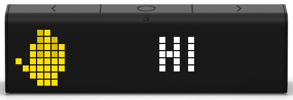

# LaMetric Notification Broadcast

[](https://packagist.org/packages/pixelbrackets/lametric-notification-broadcast/)
[](https://gitlab.com/pixelbrackets/lametric-notification-broadcast/pipelines)
[](https://gitlab.com/pixelbrackets/lametric-notification-broadcast#requirements)
[](https://spdx.org/licenses/GPL-2.0-or-later.html)
[](https://gitlab.com/pixelbrackets/lametric-notification-broadcast/-/blob/master/CONTRIBUTING.md)

Receive a message and forward it to multiple LaMetric devices in your network.



## Vision

This project provides a way to send a message to multiple LaMetric devices
in a local network.

This allows setting up one notification endpoint only in other services,
and not register all devices individually.

The endpoint also reduces the payload structure to a minimum by default.

This project does not display data permanently. Use an indicator app like
»[My Data (DIY)](https://apps.lametric.com/apps/my_data__diy_/8942)« instead.

## Requirements

- PHP

## Installation

Packagist Entry https://packagist.org/packages/pixelbrackets/lametric-notification-broadcast/

- Point your webserver to the `web` directory
- Copy `data/subscriptions.template.json` and rename it to
`data/subscriptions.json`.

## Source

https://gitlab.com/pixelbrackets/lametric-notification-broadcast/

Mirror https://github.com/pixelbrackets/lametric-notification-broadcast/

## Usage

1. Register each LaMetric in `data/subscriptions.json`
   - For field `ip` see [Device IP Discovery](https://lametric-documentation.readthedocs.io/en/latest/guides/first-steps/first-local-notification.html#discover-ip-address)
   - For field `token` see [API Key Listing](https://lametric-documentation.readthedocs.io/en/latest/guides/first-steps/first-local-notification.html#find-api-key)
1. Send a request with JSON payload to the local project instance

   HTTPie example request for domain `localhost.local`
   ```bash
   http POST localhost.local/hook message="Hi" icon="26175"
   ```

### Options

- JSON body
  - `message` – string – Text that will be displayed - Keep it short, if it is too long it will scroll
  - `icon` (optional) – string – ID of an icon in the
    [LaMetric Icon Gallery](https://developer.lametric.com/icons)

## License

GNU General Public License version 2 or later

The GNU General Public License can be found at http://www.gnu.org/copyleft/gpl.html.

## Author

Dan Untenzu (<mail@pixelbrackets.de> / [@pixelbrackets](https://pixelbrackets.de))

## Changelog

See [./CHANGELOG.md](CHANGELOG.md)

## Contribution

This script is Open Source, so please use, patch, extend or fork it.

[Contributions](CONTRIBUTING.md) are welcome!
